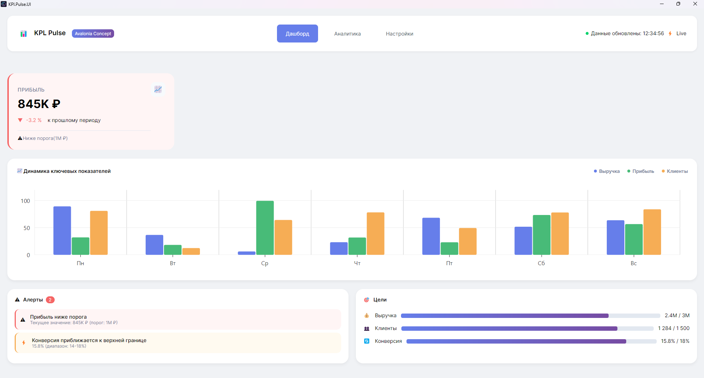
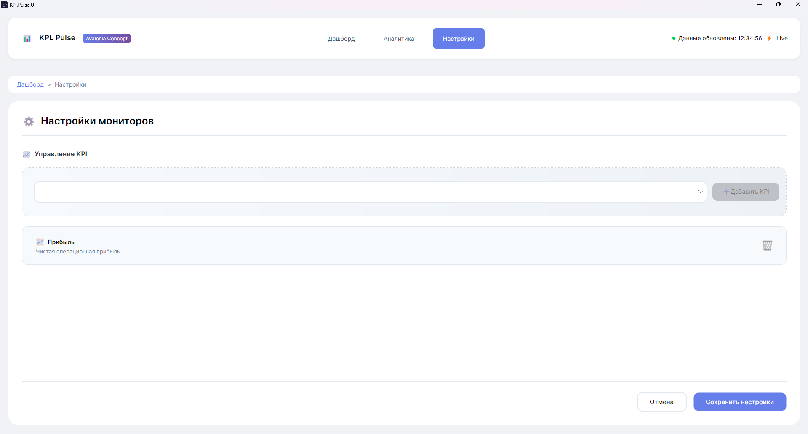

# 📊 KPI Pulse

<p align="center">
  
</p>

<p align="center">
  <strong>Легковесный монитор ключевых показателей эффективности для десктопа</strong>
</p>

<p align="center">
  
  
  
  
</p>

---

## 📋 О проекте

**KPI Pulse** — это учебно-демонстрационный проект, созданный для визуализации концепции мониторинга бизнес-показателей. Приложение позволяет в реальном времени отслеживать ключевые метрики, настраивать пороговые значения и получать уведомления при их достижении.

Проект разработан с использованием **Avalonia UI** — кроссплатформенного фреймворка, позволяющего запускать одно и то же приложение на Windows, Linux и macOS без изменения кода.

### 🎯 Цели проекта

- Демонстрация возможностей Avalonia UI для создания десктоп-приложений
- Пример реализации MVVM-архитектуры
- Показ работы с реактивными данными
- Создание кастомных контролов и стилей
- Демонстрация кроссплатформенной сборки

---

## ✨ Возможности

| | Функция | Описание |
|---|---|---|
| 📈 | **Дашборд** | Отображение ключевых KPI в реальном времени с автоматическим обновлением |
| 📊 | **Графики** | Визуализация динамики показателей |
| ⚙️ | **Настройки** | Конфигурация отслеживаемых показателей и пороговых значений |
| 💾 | **Сохранение** | Хранение настроек в JSON-файле |
| 🎨 | **Темизация** | Поддержка светлой и темной темы |

---

## 🖼️ Скриншоты

<p align="center">
  
  <br/>
  <em>Главный экран с KPI-карточками</em>
</p>

<p align="center">
  
  <br/>
  <em>Экран настройки мониторов</em>
</p>

---

## 🚀 Технологический стек

- **[.NET 8](https://dotnet.microsoft.com/)** — современная кроссплатформенная платформа
- **[Avalonia UI](https://avaloniaui.net/)** — кроссплатформенный UI-фреймворк
- **MVVM** — архитектурный паттерн для разделения логики и представления
- **JSON** — хранение настроек и конфигураций

### Зависимости

```xml
<PackageReference Include="Avalonia" Version="11.0.0" />
<PackageReference Include="Avalonia.Desktop" Version="11.0.0" />
<PackageReference Include="Microsoft.Extensions.DependencyInjection" Version="8.0.0" />
<PackageReference Include="System.Text.Json" Version="8.0.0" />